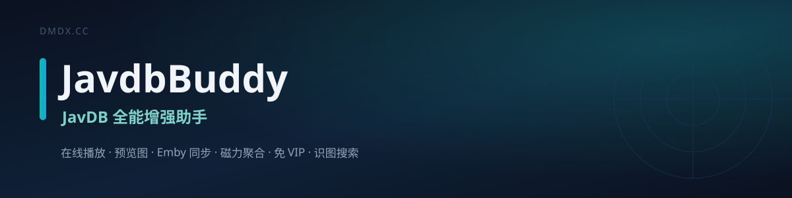
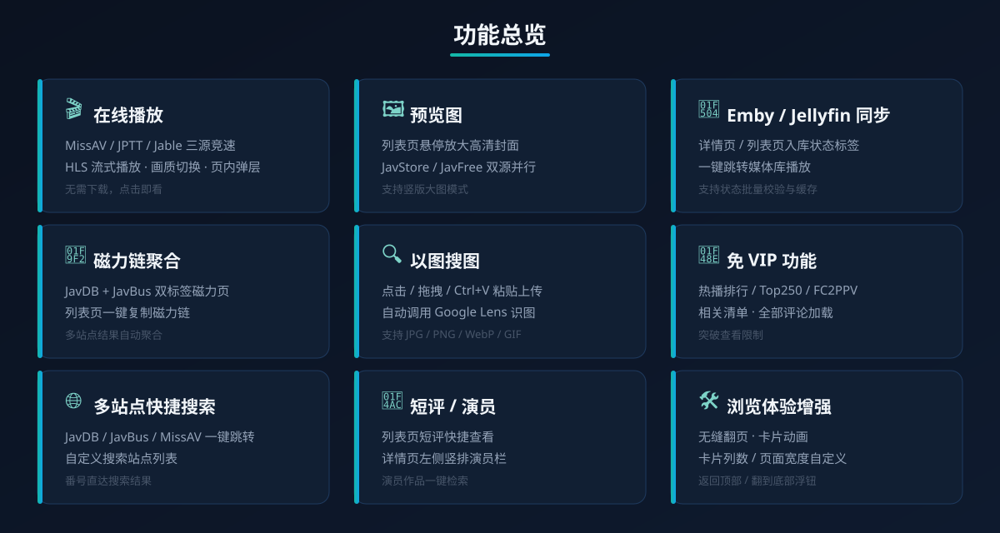
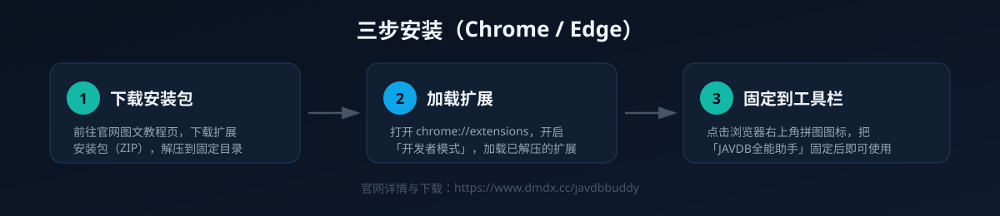

# JavdbBuddy — Javdb 全能助手

> JAVDB 一站式增强 Tampermonkey 用户脚本，集成在线播放、预览图查看、Emby / Jellyfin 入库状态同步、磁力链管理、多站点快捷搜索、免 VIP 热播/Top250/FC2PPV、全部评论、识图搜索等功能。

---

## ✨ 功能特性

### 🎬 在线播放

- **一键在线播放**：详情页 / 列表页一键播放影片，无需下载任何视频文件
- **三源智能竞速**：自动在 MissAV / JPTT / Jable 三大源站间并行解析，谁快用谁
- **HLS 流式播放**：基于 HLS.js 的 m3u8 流式播放，无需等待下载完成
- **页内弹层播放器**：不离开当前页面，弹层内直接观看，支持画质切换、倍速、音量记忆

### 🖼️ 预览图

- **列表页悬停放大**：鼠标悬停封面即弹出高清预览长图
- **双源并行加载**：JavStore / JavFree 两源并行获取，加载更快
- **详情页预览**：详情页内嵌预览视频与图片
- **竖版大图模式**：支持切换竖版封面大图浏览

### 🔄 Emby / Jellyfin 同步

- 详情页 & 列表页实时显示入库状态标签（已入库 / 未入库）
- 一键跳转 Emby / Jellyfin 播放
- 批量校验状态缓存，避免重复请求

### 🧲 磁力链管理

- 详情页**双标签磁力页**（JavDB + JavBus 双站聚合）
- 列表页快捷按钮，一键复制磁力链
- 多站点磁力搜索标签，自动聚合结果

### 🔍 搜索与识图

- **多站点快捷搜索**：详情页一键跳转 JavDB、JavBus、MissAV 等多个站点
- **以图搜图**：支持点击选择 / 拖拽 / Ctrl+V 粘贴上传，自动调用 Google Lens 识图

### 💎 免 VIP 功能

- 热播排行免 VIP 查看
- Top250 榜单免 VIP 查看
- FC2PPV 免 VIP 查看
- 相关清单免 VIP 查看
- 全部评论突破限制加载

### 🛠️ 其他增强

- **短评系统**：列表页 / 详情页快捷查看短评
- **演员栏**：详情页左侧竖排演员栏，支持快捷搜索演员作品
- **导航增强**：导航栏集成「排行榜」快捷入口（热播 / Top250 / FC2）
- **返回顶部 / 翻到底部**：快捷浮动按钮
- **无缝翻页**：列表页滚动自动加载下一页
- **卡片动画**：卡片悬停浮起动效，可调节卡片列数与页面宽度

## 📸 功能展示

点击展开截图

### 列表页
- 封面图悬停放大
- 磁力链快捷按钮
- 预览图 + 演员名字
- 短评快捷键

### 详情页
- Emby 入库状态标签 + 多网站搜索
- 双标签磁力页（JavDB + JavBus）
- 全部评论加载
- 相关清单免 VIP

### 超级功能
- 热播免 VIP
- Top250 免 VIP
- FC2 免 VIP

### 设置
- 通用设置界面

## 🚀 安装

### 前置要求

1. 安装 [Tampermonkey](https://www.tampermonkey.net/) 浏览器扩展（Chrome / Firefox / Edge / Safari）
2. 确保 Tampermonkey 已启用

### 方式一：官网安装（推荐）

👉 访问官网图文教程：[https://www.dmdx.cc/blog/javdbbuddy-userscript](https://www.dmdx.cc/blog/javdbbuddy-userscript)（功能总览 · 三步安装 · 常见问题）

### 方式二：GitHub 直接安装

👉 [点击安装脚本](https://raw.githubusercontent.com/dmdx-cc/JavdbBuddy/main/JavdbBuddy.user.js)

### 方式三：手动安装

1. 打开 Tampermonkey 控制面板
2. 点击「添加新脚本」
3. 将 `JavdbBuddy.user.js` 的全部内容粘贴进去
4. 保存

## ⚙️ 配置

安装后在 JavDB 页面右上角会出现 **⚙️ 设置** 按钮，点击可进入设置面板：

- **Emby / Jellyfin** — 填写服务器地址和 API Key，即可同步入库状态
- **预览图** — 开启/关闭列表页封面悬停放大、竖版大图模式
- **磁力链** — 配置磁力链显示和复制行为
- **搜索站点** — 自定义快捷搜索的站点列表
- **播放器** — 配置直链播放和静音策略
- **通用** — 卡片列数、页面宽度、无缝翻页、卡片动画等界面偏好

## 🌐 支持站点

| 站点 | 域名 | 功能 |
|------|------|------|
| JavDB | javdb.com | 全部功能 |
| JavBus | javbus.com | 磁力链、Cookie 复用 |
| Sehuatang | sehuatang.net | 全部功能 |
| MissAV | missav.ws | 在线播放、播放器模式 |
| Jable | jable.tv | 在线播放、播放器模式 |

## 📋 依赖

| 依赖 | 用途 |
|------|------|
| [blueimp-md5](https://github.com/blueimp/JavaScript-MD5) | MD5 哈希计算 |
| [Preact](https://preactjs.com/) | UI 渲染 |
| [GM_xhr more parallel](https://greasyfork.org/scripts/515994) | 增强 GM_xmlhttpRequest 并发能力 |
| [HLS.js](https://github.com/video-dev/hls.js/) | HLS 视频流播放（在线播放） |

## 📄 许可证

[MIT License](LICENSE)

## ⭐ 支持

如果这个脚本对你有帮助，欢迎给个 Star ⭐ 鼓励一下！
